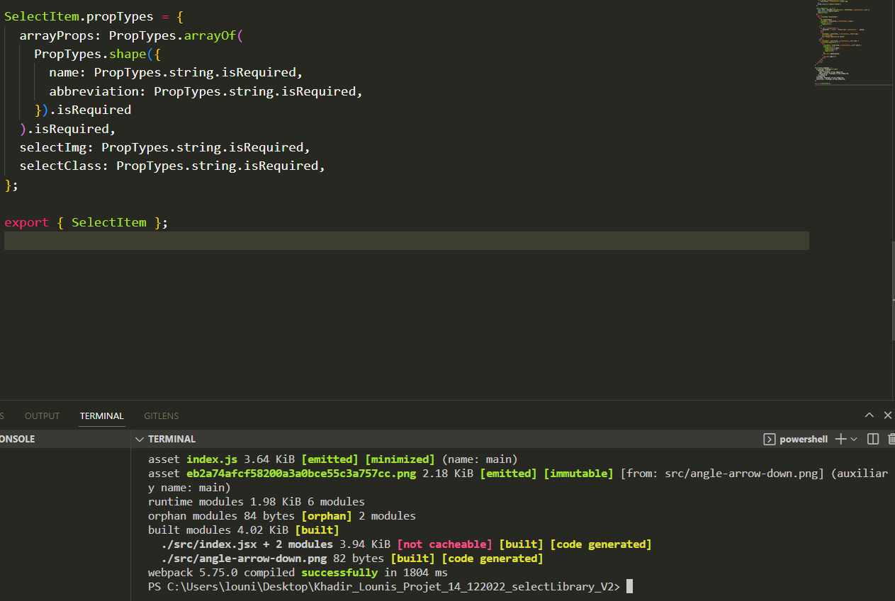

# Khadir_Lounis_Projet_14_122022_LibrarySelect

Create components, select in external library for project Wealth Health.

## Folder Structure

After creation, your project should look like this:

```
my-app/
    dist/
        index.js
    node_modules/
    src/
       index.jsx
    README.md
    package.json
    webpack.config.js

```

## Installing a Dependency

The generated project includes React and ReactDOM as dependencies. It also includes a set of scripts used by Create React App as a development dependency. You may install other dependencies (for example, React Router) with `npm`:

### for this librairy SelectItem

```
npm install @squal94/librairyselectprojet14

```

## Adding a Props

For props I used prop-types.

```
import PropTypes from "prop-types";

```

```
function SelectItem({ arrayProps, selectImg, selectClass })

```

```
SelectItem.propTypes = {
  arrayProps: PropTypes.arrayOf(
    PropTypes.shape({
      name: PropTypes.string.isRequired,
      abbreviation: PropTypes.string.isRequired,
    }).isRequired
  ).isRequired,
  selectImg: PropTypes.string.isRequired,
  selectClass: PropTypes.string.isRequired,
};

```

#### arrayProps

For arrayProps the component waits for an array of objects it consists of a key name and another key abbreviation, why abbreviation because it can be used as enter or an id or keys

```
 {
    name: "Sales",
    abbreviation: "SA",
  },

```

#### selectImg

selectImg the component waits string like :

```
./../Assets/img/angle-arrow-down.png

```

so you can swap the component icon

#### selectClass

selectClass the component waits string like :

```
"departement"

```

it is used to provide unique classnames to tags no matter how many times you use the component.

## Adding a Stylesheet

This project uses [Webpack] (https:/webpack.githubio/) to manage all assets. Webpack offers a personalized way to “extend” the concept of “import” beyond Javascript. To express that a JavaScript file depends on a CSS file, you must **import the CSS or SCSS from the reaction **:

For our custom component I decided not to create an integrated style, but rather to generate the style from the project where the library has been importing, which allows to shape it according to our use

To do this I join class react to use:

### `Scss i use BEM style`

selectClass was defined in props entrie

```Scss
<div className="selectItem">
      <div
        id="selectField"
        className={`selectItem__${selectClass}__field`}
      >
        <p id={`${selectClass}`}>
        "placeholder"
        </p>
        
      </div>
      <ul className={`selectItem__${selectClass}__list hide`}>
          <li
            className={`selectItem__${selectClass}__list--option`}
          >
            <p></p>
          </li>
      </ul>
    </div>

```

## Npm run build

Npm run build was succes !!!



## Deployment

After install dependency import with :

```
import { SelectItem } from "@squal94/librairyselectprojet14";

```

And use it in component like this:

```
  <div className="home__form__state">
    <label className="selectLabel">State</label>
        <SelectItem
        arrayProps={states}
        selectImg={arrowImg}
        selectClass="state"
        />
  </div>

```

## Something Missing?

If you have ideas for more “How To” recipes that should be on this page, [let us know](https://github.com/Squal94/Khadir_Lounis_Projet_14_122022_LibrarySelect/issues) or [contribute some!](https://github.com/Squal94/Khadir_Lounis_Projet_14_122022_LibrarySelect#readme)
